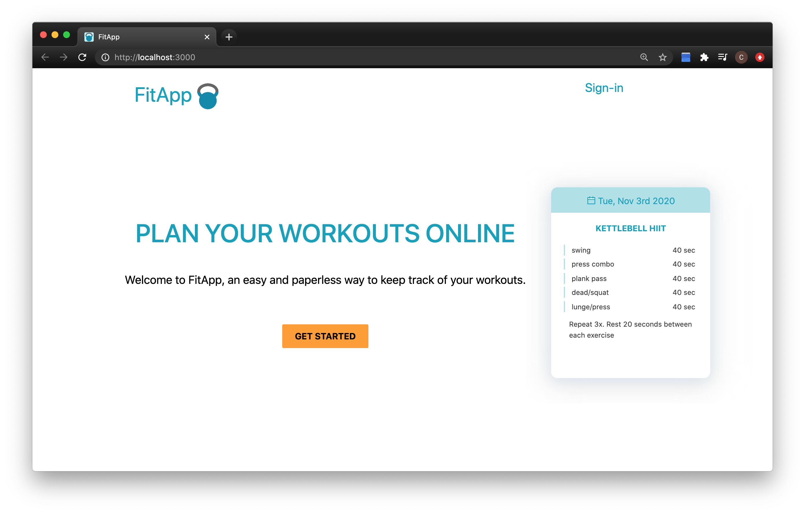
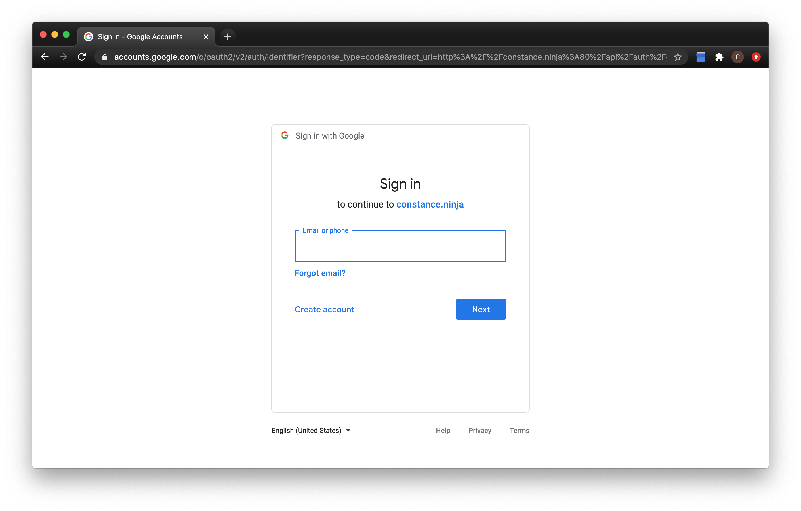
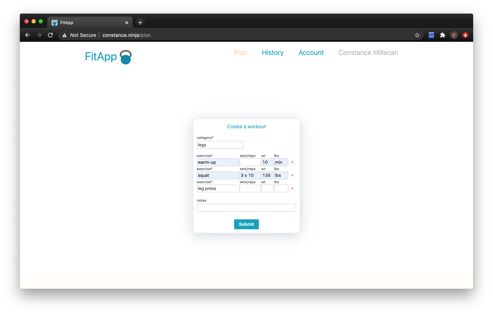
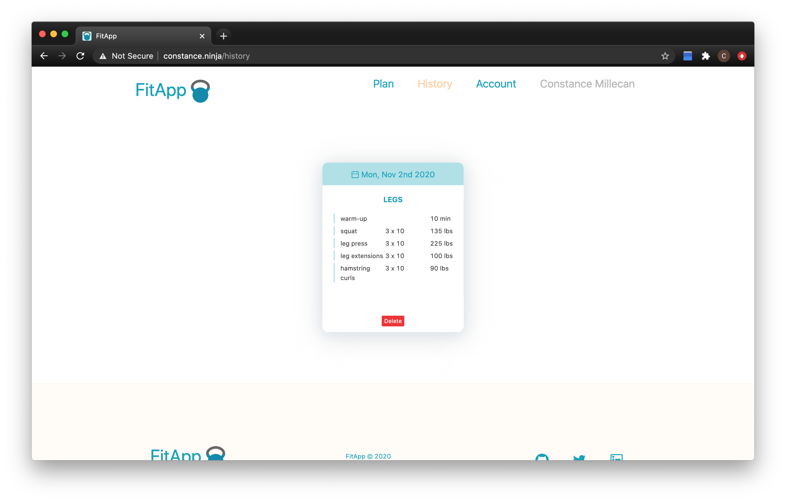
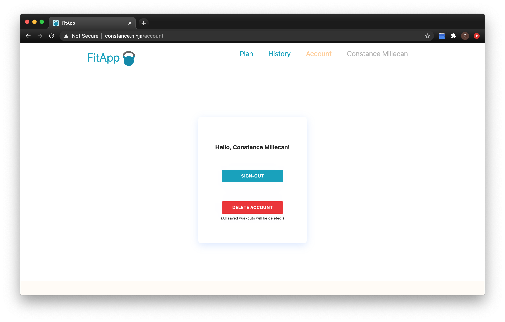

# FitApp
Plan your workouts online

### Table of Contents
* [Introduction](#intro)
* [Technologies](#tech)
* [Installation](#install)
* [Usage](#usage)
* [Contribution](#author)
* [Related Projects](#related)
* [Licensing](#license)

## <a name="intro"></a>Introduction
FitApp is a web application for creating customized workouts and tracking progress. I created FitApp because fitness has been an important part of my life. I wanted to create a simple and easy way to log workouts that would replace the tools I had used in the past such as notebooks, Google Sheets and Microsoft Word. FitApp is my final portfolio project of the foundations year at Holberton School. 

## <a name="tech"></a>Technologies
Client | Server | Database
------ | ------- | --------
|React | Express | MySQL
| CSS   | Sequelize | |

## <a name="install"></a>Installation

Clone this repository:

```git clone https://github.com/cmillecan/FitApp.git```

From the `root` AND `client` directories:

```npm install```

Build from the `client` directory:

```npm run build```

Create a file `server/secret.js` to look like this:

```
module.exports = {
  HOST: "localhost", // for local development
  PORT: "3000",
  USER: "root",
  PASSWORD: "YOUR_PASSWORD",
  DB: "YOUR_DATABASE_NAME",
  CLIENT_ID: "YOUR_GOOGLE_CLIENT_ID",
  CLIENT_SECRET: "YOUR_GOOGLE_CLIENT_SECRET",
  COOKIE_SECRET: "YOUR_COOKIE_SECRET"
}
```
The `USER`, `PASSWORD`, and `DB` variables correspond to a MySQL database instance which should be running locally on port 3306 (the default port for MySQL).

`CLIENT_ID` and `CLIENT_SECRET` represent the values you can obtain from the [Google Developer Console](https://console.developers.google.com/).

Finally, `COOKIE_SECRET` is any string that will be used as an encryption key for your cookies.


From the `root` directory:

```npm run start```

## <a name="usage"></a>Usage
1. Sign-in with Google


2. Create a workout


3. View your workout


4. Sign-out or delete your account


## <a name="author"></a>Contribution 
[Constance Millecan](http://github.com/cmillecan)

## <a name="related"></a>Related projects
* [Simple Workout Log](https://www.simpleworkoutlog.com/)
* [FitNotes](https://www.fitnotesapp.com/)

## <a name="license"></a>Licensing